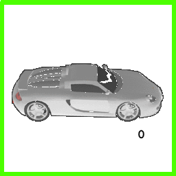
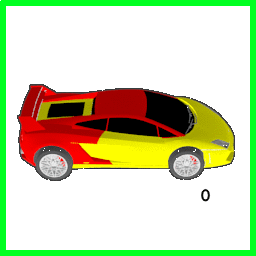

# Novel View Synthesis via Implicit Structure Learning
This is the code base for our paper [**Novel View Synthesis via Implicit Structure Learning**](todo: add link).We propose an approach to generate novel views of objects from only one view, with fine-grained control over the virtual viewpoints.

## Sample Results
View synthesis for 12 different car models. Input images are marked with green bounding boxes. Based on each input image, we generate novel views within (+0°,+30°] degrees, with a step of 1°.



Synthesis OF all 360° views for A car model, with only 6 views as input. Input images are marked with green bounding boxes. Based on each input image, we generate novel views within (-30°,+30°] degrees, with a step of 1°.



(Original backgrounds of images are gray. For better visualization the backgrounds are segmented by color thresholding and recolored to white.)
## Prerequisites
- Linux or macOS
- Python 2 or 3
- NVIDIA GPU + CUDA CuDNN

## Getting Started
### Installation
- Install PyTorch and dependencies from http://pytorch.org
- Install Torch vision from the source.
```bash
git clone https://github.com/pytorch/vision
cd vision
python setup.py install
```
- Install python libraries [visdom](https://github.com/facebookresearch/visdom), [dominate](https://github.com/Knio/dominate) and [imageio](https://pypi.org/project/imageio/)
```bash
pip install visdom
pip install dominate
pip install imageio
```
- Clone this repo:
```bash
git clone git@github.com:cx921003/ContViewSynthesis.git
cd ContViewSynthesis
```

### Pre-trained Models
- Download a pre-trained model from our [Google Drive](https://goo.gl/P7jA4a).
- Unzip the model under ``./checkpoints/`` folder.

### Testing:
- Configure the following arguments in ``./testing.sh``:
    - ``dataroot``: the path to the test images
    - ``name``: the name of the model, make sure the model exists under ``./checkpoint/``
    - ``test_views``: number of views to generate per input image
- Test the model: ``./testing.sh``

The test results will be saved to `.gif` files and a html file here: `./results/car/latest_test/`.

### Data Preparation for Training
We provide our training dataset which can be accessed as following
- Download a dataset from our [Google Drive](https://goo.gl/4bj6GD).
- Unzip the dataset under ``./datasets/`` folder.

You can also render your own dataset. todo: describe dataset format.

### Training
- Configure the following arguments in ``./training.sh``:
    - ``dataroot``: the path to the training dataset
    - ``name``: the name of the model
- Train a model:``./training.sh``
- To view training results and loss plots, run `python -m visdom.server` and click the URL http://localhost:8097. To see more intermediate results, check out `./checkpoints/car/web/index.html`


## Citation
If you find this repository useful for your research, please cite our paper.
```
to be added
```

## Acknowledgments
Code is based on [pytorch-CycleGAN-and-pix2pix](https://github.com/junyanz/pytorch-CycleGAN-and-pix2pix.git) written by [Jun-Yan Zhu](https://github.com/junyanz) and [Taesung Park](https://github.com/taesung89) and [SfmLearner-Pytorch](https://github.com/ClementPinard/SfmLearner-Pytorch) written by [Clément Pinard](https://github.com/ClementPinard).
